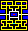

# Pacman2

#### [SFML](https://www.sfml-dev.org/download.php) is required to compile

## I had made Pacman for my final and the collisions only sort of worked. I felt like I needed to redo it. It is very different than the original, but I fixed the collisions in 5 minutes.
#### Textures and sounds and animations will come later.

## Controls
- Use WASD or the arrow keys to change directions. For shared mode WASD controls player 1 and the arrow keys control player 2.
- Use numbers 1 - 9 to change the lighting scale (I can't tell the difference past 7).

## Changes from the original
- Pacman has a light and cannot see the ghosts until they are close.
- The yellow bar at the top shows the remaining dots, because the dots are hard to find when you can't see the whole map.
- Portals glow faintly, and light up at full brightness when all dots are eaten.
- The powerups provide invincibility for 5 seconds and Pacman moves at 10 speed.
- After all of the dots have been eaten, Pacman still needs to go through a portal to get to the next level.
- When a ghost catches Pacman, Pacman becomes invincible for 3 seconds and all ghosts move at 1 speed. Only the ghost returns to its starting position.
- When a ghost is targeting Pacman, the view will fade into red.
- Bonus points are awarded for not being seen by the ghosts.
- All speeds and timings stay the same as more levels are completed. Only the map changes. The original pacman map is first, then a random map is chosen. After all maps have been beaten or a map fails to load, the error map is created.
- The ghosts only come in two types, Chasers and Signalers (Maybe more types later).

## Ghost types
#### Ghost default speed: 3
### Chaser Ghost
#### Count: 3 Chaser ghosts pick a random position on the map. If the position is valid, the ghost will move to it. Chaser ghosts move at 4 speed to get to their first position, then can chase Pacman.  Chaser ghosts move 5 speed when targeting Pacman and move at 8 speed when they have a direct line of sight with Pacman. Chaser ghosts can only track Pacman for 2 seconds.

### Signaler Ghost
#### Count: 1 Signaler ghosts always target Pacman, but move at 3 speed. If the Signaler ghost has a direct line of sight with Pacman, all other ghosts will target Pacman for 5 seconds.

## Custom Map Format
### [Pacman Maze Generator](https://shaunlebron.github.io/pacman-mazegen/tetris/many.htm)
### Maps are 28x31 (or 14x31) images
##### Example: 
</img>
### The supported image formats are bmp, png, tga, jpg, gif, psd, hdr, pic and pnm. (Formats SFML supports 2.6.0)
#### Only the left half of the map will be read because Pacman maps are symmetrical. The right half of the map is not required for reading.
### Portals
#### Portals are not required, but the map cannot be completed. Portals are holes in the side of the top, bottom, or left sides of the map.
### Tile types
-  `#FFFFFF` - Empty
-  `#000000` - Wall - Lets light through
-  `#FFFFFF` - Invalid - Doesn't let light through
-  `#FF0000` - Ghost Spawn - Solid; Ghosts move out with an animation.
-  `#FFFF00` - Dot
-  `#FF00FF` - Powerup
-  `#FFFFFF` - Pacman Spawn - Non-solid
